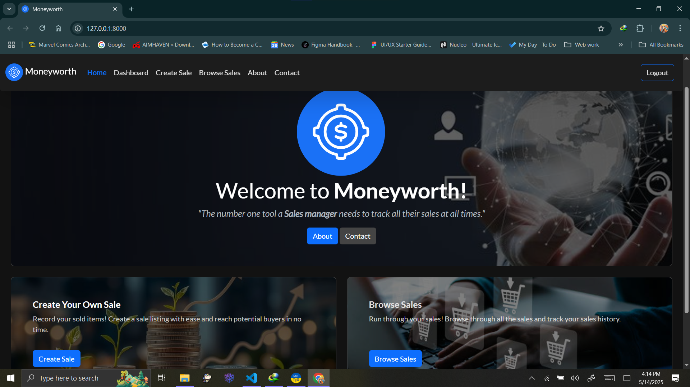
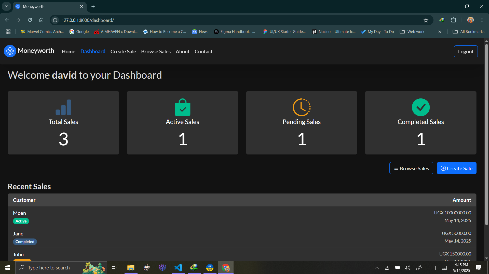
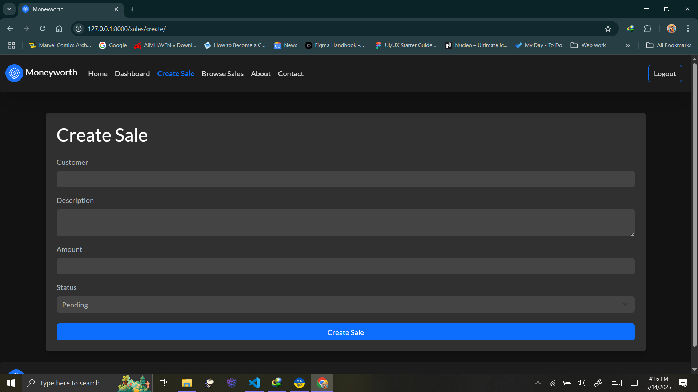
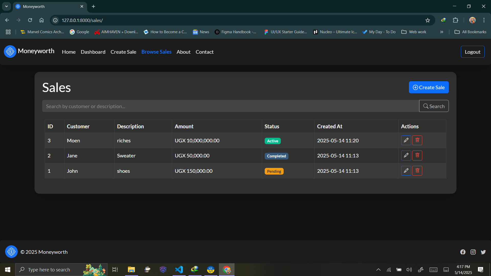
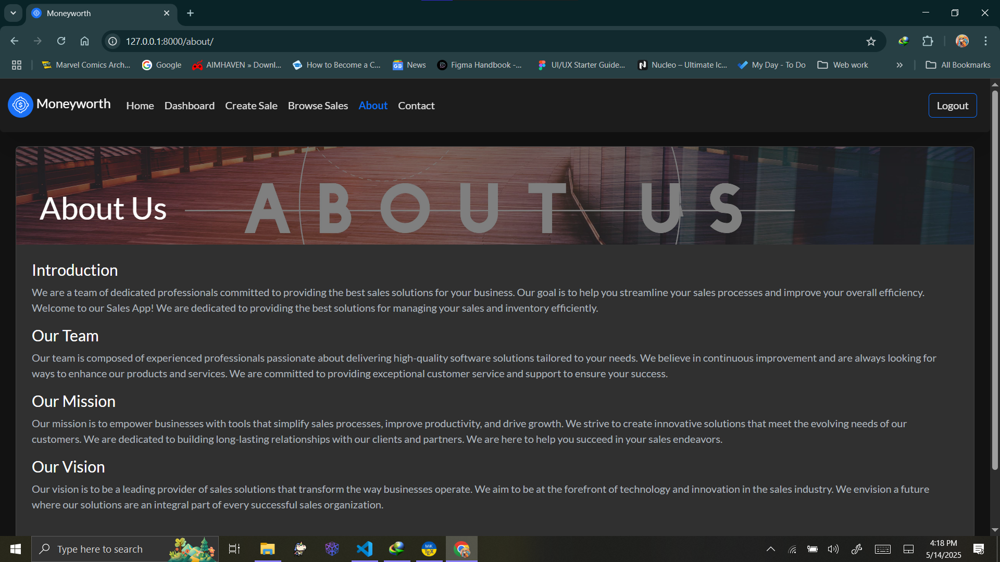
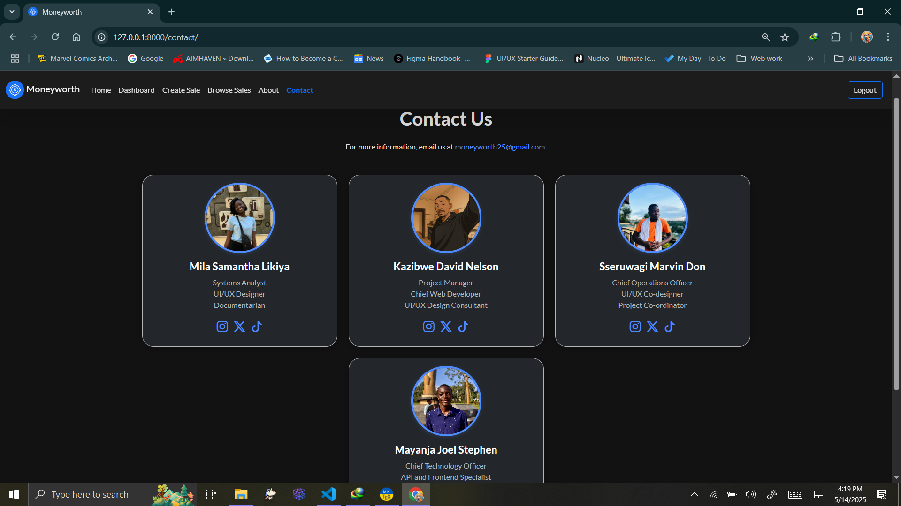
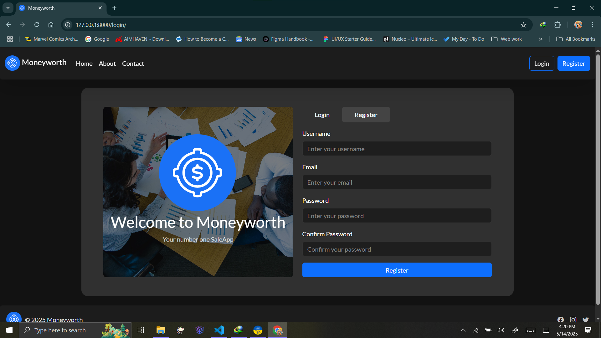

# Moneyworth

A simple web application built with Django for managing sales listings. Users can browse, create, and manage sales entries, view dashboards, and manage their profiles. The app features a modern UI with a navigation bar, hero section, and footer.

---

## Features

- User authentication (login/register)
- Dashboard for users
- Browse all sales listings
- Create new sale entries
- User profile management
- About and Contact pages
- Responsive design with Bootstrap

## Technologies Used

- Python 3
- Django
- Bootstrap 5

---

## Setup Instructions

1. __Clone the repository:**

   ```sh
   git clone <repo-url>
   cd SDP_website
   ```

2. __Create a virtual environment (recommended):**

   - On __Windows**:

     ```sh
     python -m venv env
     .\env\Scripts\activate
     ```

   - On __macOS/Linux**:

     ```sh
     python3 -m venv env
     source env/bin/activate
     ```

3. __Install dependencies:**

   ```sh
   pip install -r requirements.txt
   # Or, if requirements.txt is missing:
   pip install django
   ```

4. __Apply database migrations:**

   ```sh
   python sdp_project/manage.py migrate
   ```

5. __Create a superuser (optional, for admin access):**

   ```sh
   python sdp_project/manage.py createsuperuser
   ```

6. **Run the development server:__

   ```sh
   python sdp_project/manage.py runserver
   ```

The application will be available at [http://localhost:8000/](http://localhost:8000/).

---

## Accessing Key Pages

| Page         | URL                                                                        | Notes          |
| ------------ | -------------------------------------------------------------------------- | -------------- |
| Home         | [http://localhost:8000/](http://localhost:8000/)                           | Public         |
| Dashboard    | [http://localhost:8000/dashboard/](http://localhost:8000/dashboard/)       | Login required |
| Browse Sales | [http://localhost:8000/sales/](http://localhost:8000/sales/)               | Public         |
| Create Sale  | [http://localhost:8000/sales/create/](http://localhost:8000/sales/create/) | Login required |
| About        | [http://localhost:8000/about/](http://localhost:8000/about/)               | Public         |
| Contact      | [http://localhost:8000/contact/](http://localhost:8000/contact/)           | Public         |

---

## Usage

- Register a new account or log in.
- Browse existing sales or create a new sale entry.
- Access your dashboard to manage your listings and profile.
- (Admin) Log in to `/admin/` to manage users and sales (if superuser).

---

## Screenshots

Here are some screenshots showcasing the application's interface:

### Home Page



### Dashboard Page



### Create Sale Page



### Browse Sales Page



### About Page



### Contact Page



### Login & Register Page



## Folder Structure

```SDP_website/
├── README.md
├── requirements.txt
├── Report.pdf
├── Report.tex
├── screenshots/(screenshots found here)
├── sdp_project/
│   ├── manage.py
│   ├── core/
│   │   ├── forms.py
│   │   ├── models.py
│   │   ├── urls.py
│   │   ├── views.py
│   │   └── migrations/
│   └── sdp_project/
│       ├── settings.py
│       └── urls.py
├── static/
│   ├── css/(css found here)
│   ├── images/(images found here)
│   └── js/(js files found here)
└── templates/
   └── core/(app template found here)
```
